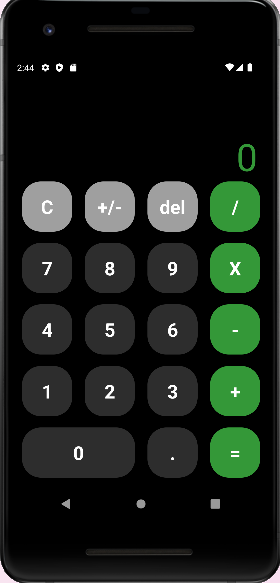

# React Native Calculator

### In this application you will find a fully functional calculator with the operations of addition, subtraction, multiplication and division. This project was built using React Native and looks like this: 
<br />

<br />
<br />

### To run this project you must:


1. Intall proyect dependencies:

```
yarn install
```
2. Run the proyect using the following command:
```
npx react-native run-android
```